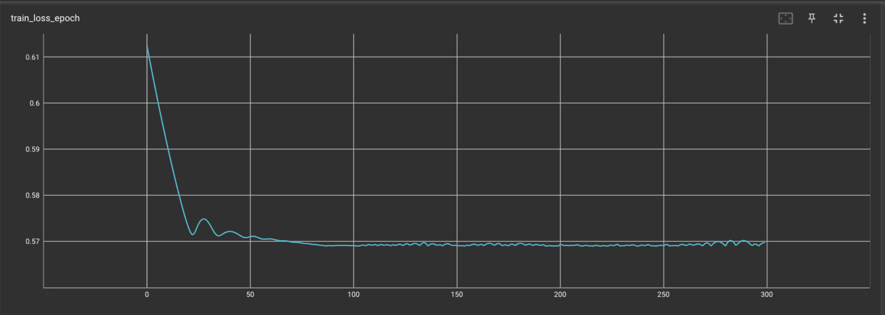

# Conditional time series forecasting with convolutional neural networks

This repository contains an implementation of the network described in the paper [Conditional time series forecasting with convolutional neural networks](https://arxiv.org/abs/1703.04691).

## Experiments

The network is tested on a time series S&P 500 index dataset. The data is available in the folder `raw_data` and comprises closing prices since 2019.
The network architechture implementation supports conditioning on other time series but this feature is not tested out on a real dataset.

Doing so, the training loss (defined as MAE as in the paper) is as follows when plotted against number of epochs:

